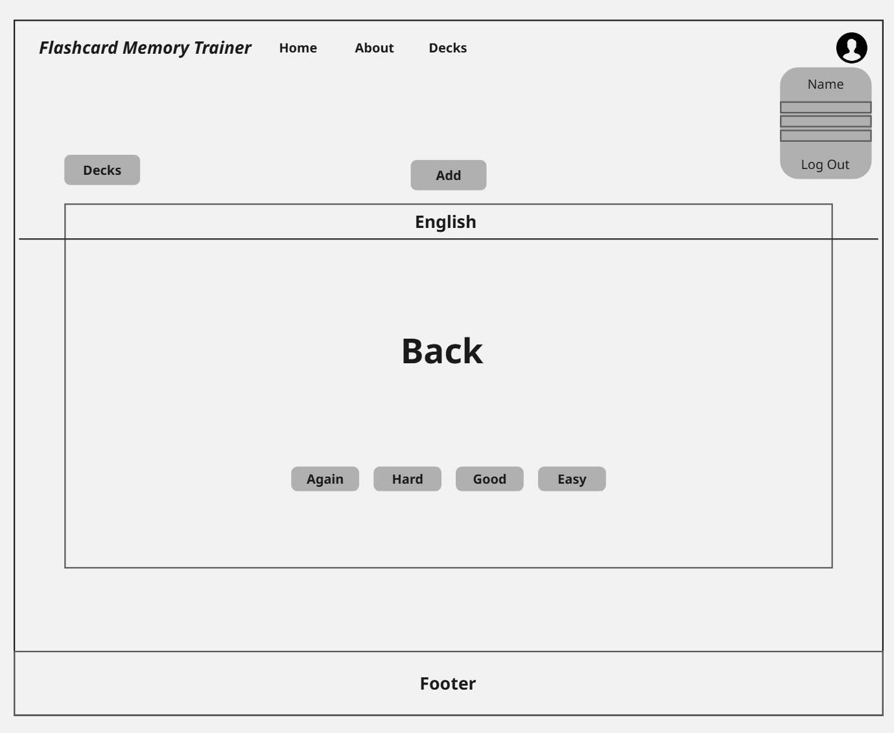

# Flashcard Memory Trainer

Flashcard Memory Trainer is a web-based learning tool designed to help users **remember information more effectively** through flashcards and **spaced repetition**.  
It’s a side project inspired by [Anki](https://apps.ankiweb.net/), but built with a modern tech stack and a focus on simplicity, accessibility, and customization.

---

## Project Overview

The idea behind Flashcard Memory Trainer is simple:

- **Flashcards** are a proven method for active recall learning.
- **Spaced Repetition** (via the [SuperMemo 2](https://www.supermemo.com/en/archives1990-2015/english/ol/sm2) algorithm) optimizes review schedules to maximize memory retention.
- By combining these two techniques, the app helps learners remember facts, vocabulary, and concepts **just before they forget**.

This project is **educational**, **open for personal use**, and a **portfolio showcase** of full-stack development skills.

---

## Key Features

- Create, edit, and organize flashcards into decks.
- Review flashcards and rate your recall (0–5 scale).
- Automatic scheduling using **SuperMemo 2** algorithm.
- Track progress: repetitions, ease factor, and due dates.
- Responsive design for desktop and mobile devices.
- PostgreSQL database to store cards and review history.
- Modern UI with clean and accessible design.

---

## Tech Stack

### **Frontend**

- [React](https://reactjs.org/) + [Vite](https://vitejs.dev/) for fast development
- [Tailwind CSS](https://tailwindcss.com/) for styling
- Axios to fetch API for communicating with backend

### **Backend**

- [Node.js](https://nodejs.org/) + [Express](https://expressjs.com/)
- [PostgreSQL](https://www.postgresql.org/) for persistent data storage
- Custom implementation of **SuperMemo 2 (SM2)** algorithm in JavaScript

---

## Roadmap

- [ ] Deck sharing between users
- [ ] Import/export cards (CSV, Anki format)
- [ ] Rich content support (images, audio)
- [ ] Offline mode (PWA)
- [ ] AI-powered flashcard generation

---

## License

MIT License — feel free to use, modify, and learn from this project.

---

## Wireframes

